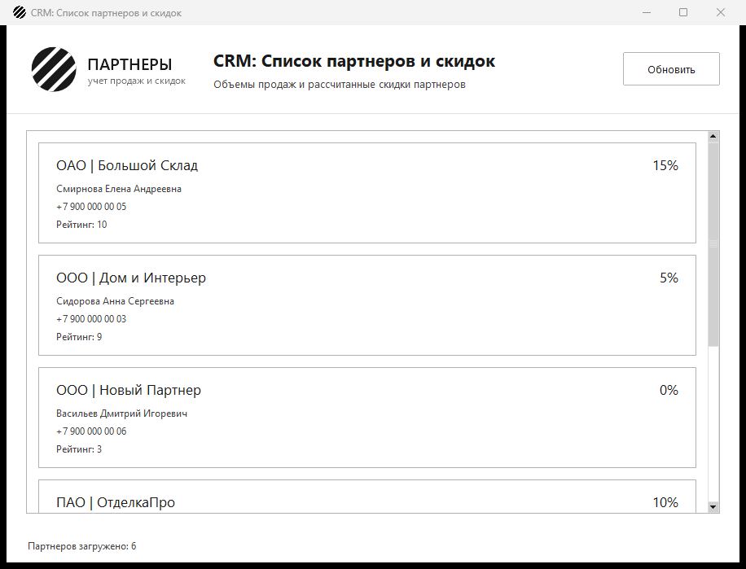

# Наполнение интерфейса, отладка и стресс-тестирование

Итоговая сборка проекта: окно наполняется реальными данными из базы и не
падает на пустой истории продаж.

- Список карточек связан с кодом из задания 2: функция
  `get_partners_with_discounts` делает один запрос с `LEFT JOIN` и
  `SUM(quantity)` по всем партнерам, а процент скидки считает функция из
  задания 1. При запуске на экране сразу актуальный список партнеров с
  контактными данными и рассчитанной скидкой.
- Партнер без истории продаж: `SUM(quantity)` дает `NULL`, объем приводится
  к 0, скидка показывается как 0 %, `TypeError` не возникает.
- База недоступна: окно открывается, список пустой, причина выводится в
  строке состояния — приложение не падает.
- Кнопка «Обновить» перечитывает данные из базы.



На скриншоте партнер «Новый Партнер» — как раз случай пустой истории
продаж: скидка 0 %.

## Файлы

| Файл | Назначение |
| --- | --- |
| `app.py` | экранная форма и наполнение карточек данными |
| `ui_style.py` | цвета и шрифты из руководства по стилю |
| `resources/` | логотип компании и иконка приложения |
| `db.py` | подключение к PostgreSQL через psycopg2 |
| `partner_service.py` | SQL-запросы с группировкой и расчет скидки |
| `partner_discount.py` | функция `calculate_partner_discount` |
| `main.py` | консольная проверка выборки из БД |
| `schema.sql` | таблицы `partners`, `sales_history` и тестовые данные |
| `test_partner_discount.py` | тесты границ скидок |
| `test_partner_service.py` | тесты работы с БД на поддельном соединении |

## Запуск

```
pip install -r requirements.txt
psql -U postgres -c "CREATE DATABASE partners_db"
psql -U postgres -d partners_db -f schema.sql
python app.py
```

## Демонстрационный тест

```
python -m unittest -v
```

13 тестов: 8 на границы скидок и 5 на работу с базой через поддельное
соединение — партнер с продажами, пустая история (`NULL`), нулевой объем,
несуществующий партнер и список партнеров целиком. Реальная база для этих
тестов не нужна.
