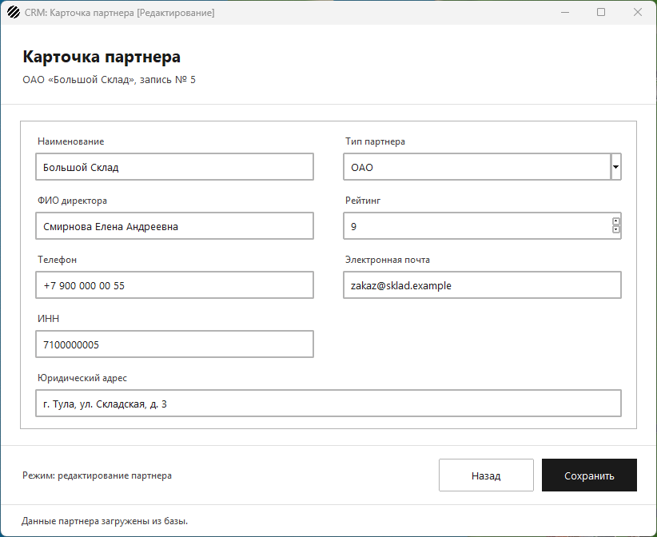
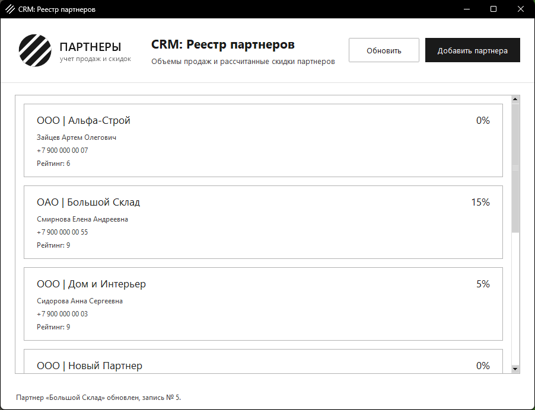

# Интеграция формы с БД (CRUD-операции и обновление UI)

Задание: карточка должна работать в двух режимах — создание новой записи
и изменение существующей с автоматической подгрузкой данных, — а список
на главной форме после сохранения обновляться сам.

## Режим добавления

1. Кнопка «Добавить партнера» на главной форме открывает пустую карточку
   (`PartnerEditWindow` без переданного партнера).
2. «Сохранить» собирает значения полей и выполняет `insert_partner`:
   `INSERT INTO partners ... RETURNING id`. Рейтинг перед запросом
   приводится к целому числу.
3. После успешного запроса карточка закрывается, реестр показывается
   снова и перечитывает базу, поэтому новый партнер сразу в списке, а в
   строке состояния — номер созданной записи.


## Режим редактирования

1. Нажатие (или двойное нажатие) на карточку партнера в списке открывает
   ту же форму с его данными.
2. Данные берутся не из списка, а из базы: `load_partner` делает запрос
   `get_partner_with_discount` по `id`. Реестр мог быть загружен давно, а
   в карточке нужны актуальные значения. Если база недоступна, карточка
   покажет данные из реестра и скажет об этом в строке состояния.
3. «Сохранить» выполняет `update_partner` — `UPDATE partners ... WHERE
   id = %(id)s`, после чего реестр так же перечитывается.





## Ссылочная целостность на уровне кода

- **Обновление идет по первичному ключу**, а не по названию партнера.
  `sales_history.partner_id` ссылается на ту же запись, поэтому
  переименование партнера не рвет его историю продаж.
- **`INSERT ... RETURNING id`**: карточка сразу запоминает ключ новой
  записи, и повторное нажатие «Сохранить» делает `UPDATE`, а не второй
  `INSERT` — дублей партнера не появляется.
- **Если записи уже нет** (партнера удалили, пока карточка была
  открыта), `UPDATE` вернет `rowcount = 0`. Приложение это видит и
  добавляет запись заново: введенные данные не пропадают, а ссылок на
  несуществующий `id` не возникает.
- **Уникальность ИНН и наименования** обеспечивают ограничения базы из
  `schema.sql`; приложение не пытается их обойти, а показывает ошибку
  вместо аварийного завершения.
- **Одна транзакция на операцию**: `commit` вызывается сразу после
  запроса, а при ошибке соединение закрывается без подтверждения, то
  есть половинчатых изменений в базе не остается.

Ошибки базы и неверный рейтинг сейчас выводятся в строку состояния
карточки, окно при этом остается открытым и введенное не теряется.
Диалоговые окна с ошибками, предупреждениями и уведомлениями — в
задании «Обработка исключений и интерактивные уведомления (UX/UI)».

## Файлы

| Файл | Назначение |
| --- | --- |
| `partner_edit_window.py` | карточка партнера: чтение по `id`, INSERT и UPDATE |
| `partner_service.py` | запросы выборки и записи, расчет скидки |
| `main_window.py` | реестр партнеров и его перечитывание после сохранения |
| `navigation.py` | переходы между окнами, возврат с обновлением списка |
| `form_fields.py` | поля формы: подсказки, список типов, счетчик рейтинга |
| `partner_cards.py`, `ui_style.py`, `app_resources.py` | список карточек, стили, логотип и иконка |
| `app.py`, `db.py`, `main.py`, `schema.sql` | запуск, подключение к базе, консольная проверка, таблицы |
| `test_partner_crud.py` | тесты сохранения: запросы и поведение окна |
| `app_test_base.py` | общая заглушка базы для оконных тестов |
| `test_partner_form.py`, `test_navigation.py`, `test_partner_service.py`, `test_partner_discount.py` | тесты предыдущих заданий |

## Запуск

```
pip install -r requirements.txt
psql -U postgres -c "CREATE DATABASE partners_db"
psql -U postgres -d partners_db -f schema.sql
python app.py
```

## Демонстрационный тест

```
python -m unittest -v
```

43 теста, из них 13 на сохранение карточки: INSERT возвращает номер
новой записи и отправляет все поля, UPDATE идет по первичному ключу и
сообщает, что строки уже нет, транзакция подтверждается; из окна —
новый партнер уходит в базу, рейтинг записывается числом, после
сохранения карточка закрывается и реестр перечитывает список, партнер из
списка обновляется по своему `id`, карточка берет актуальные данные из
базы, удаленная запись сохраняется заново, а при нечисловом рейтинге или
недоступной базе карточка остается открытой и данные не теряются.
