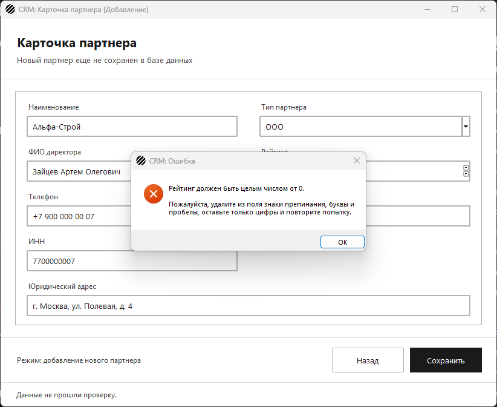
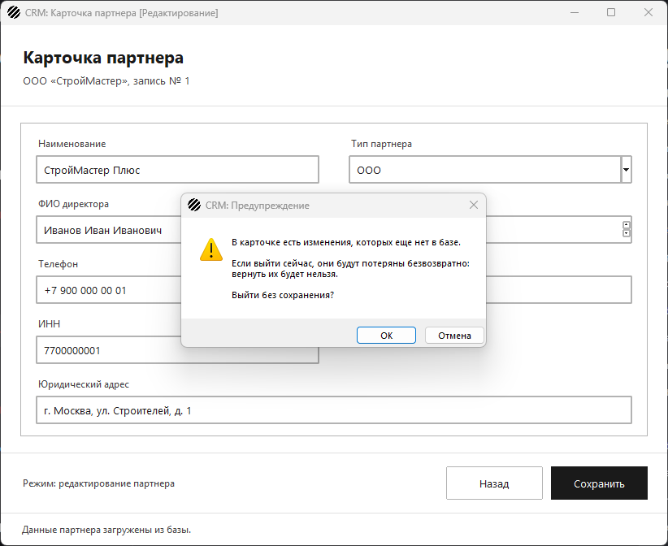
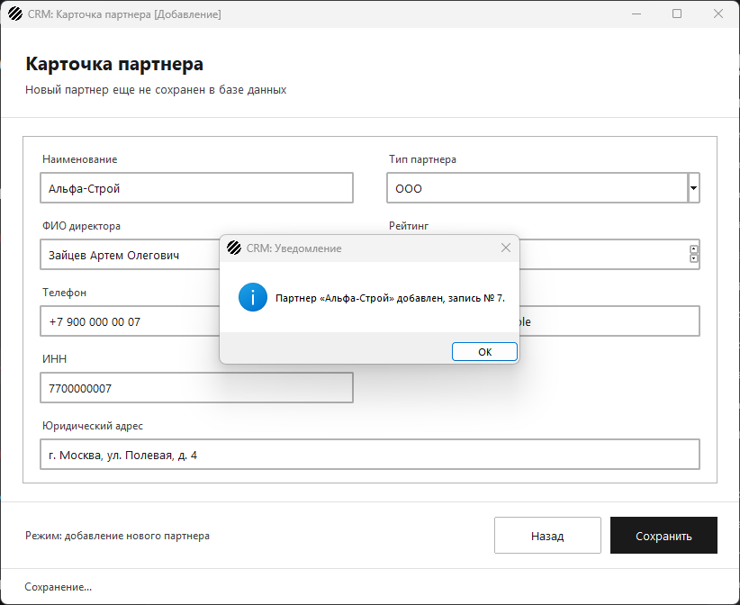

# Обработка исключений и интерактивные уведомления (UX/UI)

Задание: система не должна падать при ошибках ввода. Менеджер получает
понятные инструкции по исправлению своих действий через системные
диалоговые окна.

Папка называется «Обработка исключений и интерактивные уведомления
(UX-UI)»: слеш в имени папки недопустим.

## Проверка данных перед отправкой в БД

Проверки собраны в `validation.py`, окно вызывает их в `try ... except`
и ловит `ValidationError` до того, как данные уйдут в базу.

1. **Рейтинг** — целое неотрицательное число. Буквы, точка, запятая,
   пустое поле и минус операцию прерывают: в базе поле объявлено как
   `INTEGER` с проверкой `rating >= 0`, такой запрос все равно не
   выполнился бы.
2. **Обязательные поля.** Наименование и электронная почта не должны
   быть пустыми. Так же проверяются остальные поля, объявленные в
   `schema.sql` как `NOT NULL`: ФИО директора, телефон, ИНН и
   юридический адрес — иначе менеджер получил бы не инструкцию, а
   текст ошибки PostgreSQL.
3. **Почта** должна содержать `@`, иначе адрес заведомо неверный.

Текст каждой ошибки говорит, что именно не так и что сделать:
«Рейтинг должен быть целым числом от 0. Пожалуйста, удалите из поля
знаки препинания, буквы и пробелы, оставьте только цифры и повторите
попытку».

## Диалоговые окна

Все три типа собраны в `dialogs.py`, поэтому у каждого свой заголовок и
своя пиктограмма.

| Что случилось | Тип окна | Заголовок | Пиктограмма |
| --- | --- | --- | --- |
| Данные не прошли проверку | Ошибка | `CRM: Ошибка` | красный крестик |
| База данных недоступна при сохранении или загрузке списка | Ошибка | `CRM: Ошибка` | красный крестик |
| «Назад» нажали, когда поля уже изменены | Предупреждение | `CRM: Предупреждение` | восклицательный знак |
| Партнер добавлен или обновлен | Уведомление | `CRM: Уведомление` | инфо-значок |







- **Ошибка.** Карточка остается открытой, введенное не пропадает,
  в строке состояния — короткая пометка, в окне — что исправить.
  Ошибка базы данных дополнительно сообщает причину и просит проверить,
  запущен ли сервер PostgreSQL.
- **Предупреждение.** Карточка сравнивает текущие значения полей со
  снимком, сделанным при открытии. Если менеджер что-то поменял, выход
  по кнопке «Назад», крестику окна или Esc сначала спрашивает
  подтверждение и честно предупреждает, что вернуть данные будет
  нельзя. «Отмена» оставляет карточку открытой.
- **Уведомление.** После успешного `INSERT` или `UPDATE` показывается
  номер записи, и только потом реестр перечитывает базу.

## Файлы

| Файл | Назначение |
| --- | --- |
| `validation.py` | проверка полей карточки и текст ошибок |
| `dialogs.py` | окна ошибки, предупреждения и уведомления |
| `partner_edit_window.py` | карточка партнера: проверка, сохранение, предупреждение при выходе |
| `main_window.py` | реестр партнеров и сообщение о недоступной базе |
| `navigation.py`, `partner_cards.py`, `form_fields.py`, `ui_style.py`, `app_resources.py` | переходы, список, поля формы, стили и ресурсы |
| `app.py`, `db.py`, `partner_service.py`, `partner_discount.py`, `main.py`, `schema.sql` | запуск, база, запросы, расчет скидки, таблицы |
| `test_validation.py` | тесты проверок без окон |
| `test_notifications.py` | тесты того, какое окно показывается в каждой ситуации |
| `app_test_base.py` | заглушка базы и запись вызванных диалогов |
| `test_partner_crud.py`, `test_partner_form.py`, `test_navigation.py`, `test_partner_service.py`, `test_partner_discount.py` | тесты предыдущих заданий |

## Запуск

```
pip install -r requirements.txt
psql -U postgres -c "CREATE DATABASE partners_db"
psql -U postgres -d partners_db -f schema.sql
python app.py
```

## Демонстрационный тест

```
python -m unittest -v
```

68 тестов. Из них 14 на проверку данных: корректная карточка проходит,
рейтинг становится числом, пробелы обрезаются, пустое наименование и
пустая почта отклоняются, почта без «@» отклоняется, каждое обязательное
поле проверяется, в тексте ошибки есть инструкция; отдельно — рейтинг
ноль, число с пробелами, буквы, точка, минус и пустое поле.

Еще 11 тестов проверяют сами уведомления: у окон правильные заголовки;
ошибка показывается при нечисловом и отрицательном рейтинге, при пустом
наименовании и почте, при недоступной базе — и карточка при этом
остается открытой, а данные не уходят в базу; реестр сообщает о
недоступной базе; после сохранения показывается уведомление и карточка
закрывается; при выходе с несохраненными изменениями появляется
предупреждение, «Отмена» оставляет карточку открытой, подтверждение
возвращает в реестр, а без изменений вопрос не задается.

В тестах диалоги не показываются: окна вызывают их через модуль
`dialogs`, а тест подменяет функции и запоминает, что было показано.
