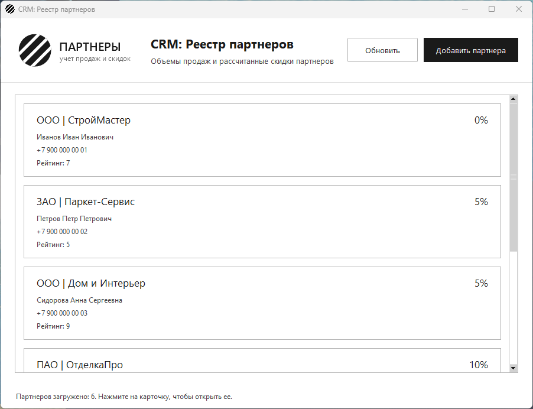
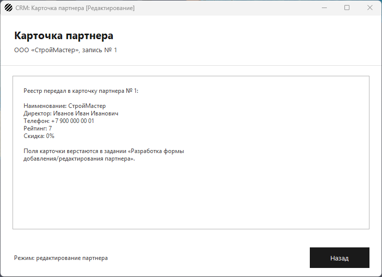
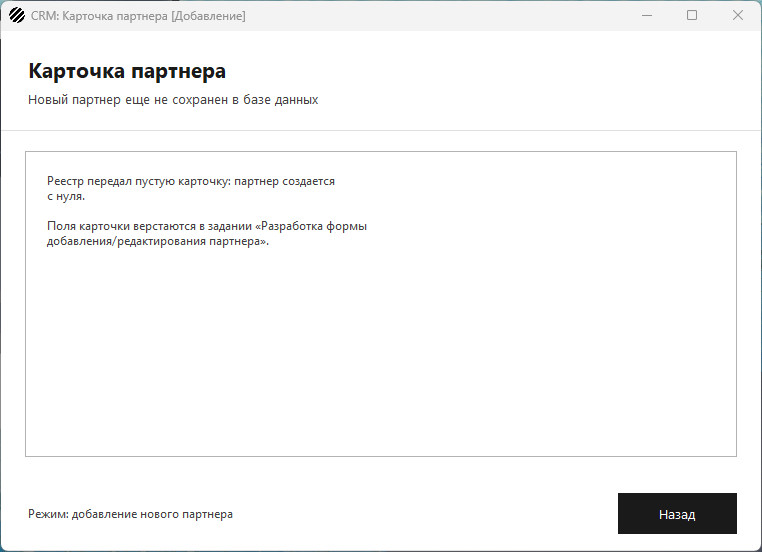

# Проектирование многооконной архитектуры и навигации

Задание: приложение должно перестать быть одностраничным. Нужна система
переключения экранов, которая позволяет менеджеру перемещаться по
приложению без потери состояния и аварийных завершений.

## Как устроена навигация

1. **Два окна.** `MainWindow` (`main_window.py`) — главная форма со
   списком партнеров, `PartnerEditWindow` (`partner_edit_window.py`) —
   форма добавления и редактирования. Главная форма наследуется от
   `tk.Tk`, карточка — от `tk.Toplevel`: второе окно живет внутри того же
   цикла событий и не запускает вторую копию Tkinter.
2. **Переключение экранов вынесено в отдельный класс** `Navigator`
   (`navigation.py`). Окна не создают друг друга: главная форма просит
   навигатор открыть карточку, карточка просит вернуть реестр. Поэтому
   переходы описаны в одном месте, а не размазаны по обоим окнам.
3. **Последовательный переход.** При открытии карточки реестр скрывается
   (`withdraw`), при возврате — показывается снова (`deiconify`). Главное
   окно при этом не пересоздается, так что загруженный список партнеров,
   позиция прокрутки и строка состояния остаются на месте: после возврата
   повторный запрос к базе не нужен.
4. **Кнопка «Добавить партнера»** в шапке реестра открывает карточку в
   режиме добавления, нажатие на карточку партнера в списке — в режиме
   редактирования: в окно передается словарь с данными партнера, включая
   его `id`.
5. **Кнопка «Назад»** закрывает карточку и возвращает менеджера на
   главную форму. Туда же ведут крестик окна (`WM_DELETE_WINDOW`) и
   клавиша Esc — иначе реестр остался бы скрытым и приложение осталось бы
   без единого видимого окна.
6. **Второе такое же окно не открывается.** Навигатор помнит открытую
   карточку: повторное нажатие кнопки поднимает уже открытое окно, а не
   создает копию поверх.

## Заголовки окон

У каждого окна свой заголовок, по которому видно его текущее назначение:

| Окно | Заголовок |
| --- | --- |
| Главная форма | `CRM: Реестр партнеров` |
| Карточка нового партнера | `CRM: Карточка партнера [Добавление]` |
| Карточка существующего партнера | `CRM: Карточка партнера [Редактирование]` |

Заголовок карточки выбирается по тому, передан ли партнер из реестра:
передан — режим редактирования, не передан (`None`) — добавление.







## Файлы

| Файл | Назначение |
| --- | --- |
| `app.py` | точка входа: запускает навигатор |
| `navigation.py` | `Navigator` — переключение между окнами |
| `main_window.py` | `MainWindow` — реестр партнеров |
| `partner_edit_window.py` | `PartnerEditWindow` — карточка партнера |
| `partner_cards.py` | карточки списка и прокрутка |
| `ui_style.py` | цвета и шрифты из руководства по стилю |
| `app_resources.py` | логотип и иконка окна |
| `db.py` | подключение к PostgreSQL через psycopg2 |
| `partner_service.py` | запросы к базе и расчет скидки |
| `partner_discount.py` | функция `calculate_partner_discount` |
| `main.py` | консольная проверка выборки из БД |
| `schema.sql` | таблицы `partners`, `sales_history` и тестовые данные |
| `app_test_base.py` | заглушка базы для оконных тестов |
| `test_navigation.py` | тесты переходов и заголовков окон |
| `test_partner_service.py` | тесты выборки на поддельном соединении |
| `test_partner_discount.py` | тесты границ скидок |

## Запуск

```
pip install -r requirements.txt
psql -U postgres -c "CREATE DATABASE partners_db"
psql -U postgres -d partners_db -f schema.sql
python app.py
```

Пароль к базе берется из переменной окружения `DB_PASSWORD`, в коде он не
хранится. Если база недоступна, окно все равно откроется: список будет
пустым, а причина — в строке состояния.

## Демонстрационный тест

```
python -m unittest -v
```

22 теста: 8 на переходы между окнами, 6 на выборку из базы через
поддельное соединение и 8 на границы скидок. Тесты навигации создают
настоящие окна Tkinter, но данные берут из заглушки, поэтому база для них
не нужна; на машине без графической оболочки они пропускаются.

Что проверяют тесты навигации: у реестра свой заголовок; кнопка
«Добавить партнера» открывает карточку в режиме добавления; нажатие на
партнера — в режиме редактирования и с его `id`; на время работы с
карточкой реестр скрыт; «Назад» закрывает карточку и показывает реестр;
список партнеров после возврата не потерян; второе нажатие не открывает
вторую карточку; крестик окна обработан.
