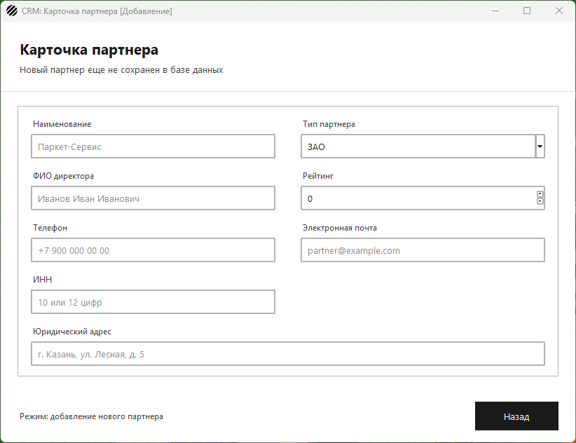
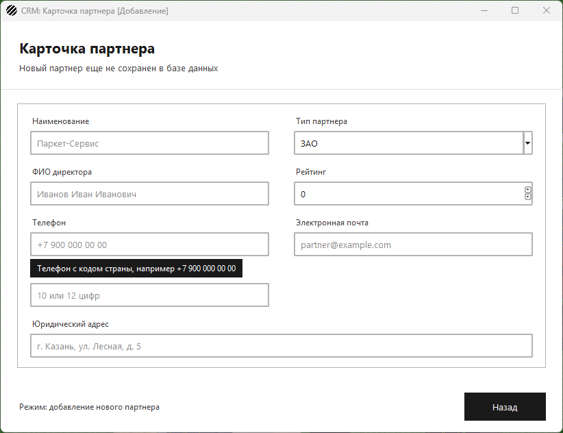
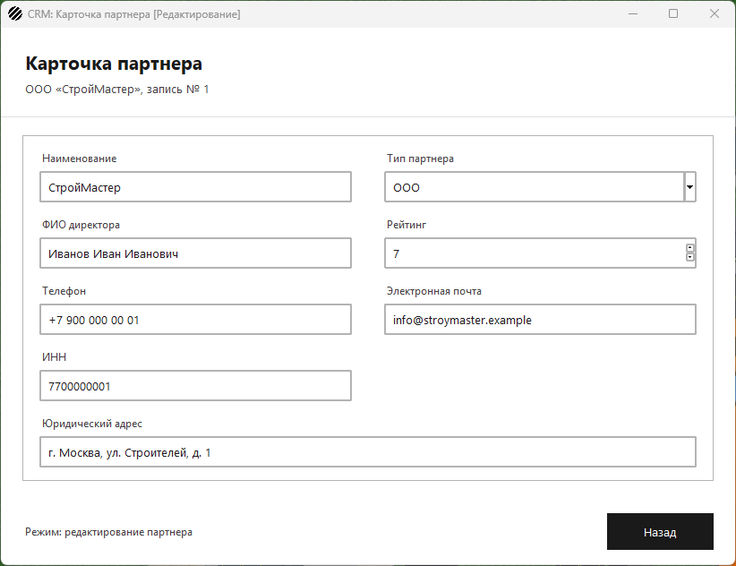

# Разработка формы добавления/редактирования партнера

Задание: сверстать форму `PartnerEditWindow` по списку полей из ТЗ,
добавить визуальные подсказки для телефона и почты и прокомментировать
только неочевидные места кода.

Папка называется «Разработка формы добавления-редактирования партнера»:
слеш в имени папки недопустим.

## Поля формы

| Поле | Виджет | Подсказка |
| --- | --- | --- |
| Наименование | текстовое поле | `Паркет-Сервис` |
| Тип партнера | выпадающий список `ttk.Combobox` | ЗАО, ООО, ИП, ОАО, ПАО |
| ФИО директора | текстовое поле | `Иванов Иван Иванович` |
| Рейтинг | счетчик `ttk.Spinbox` от 0 | целое неотрицательное |
| Телефон | текстовое поле | `+7 900 000 00 00` и всплывающая подсказка |
| Электронная почта | текстовое поле | `partner@example.com` и всплывающая подсказка |
| ИНН | текстовое поле | `10 или 12 цифр` |
| Юридический адрес | текстовое поле | `г. Казань, ул. Лесная, д. 5` |

ИНН и юридический адрес есть в таблице `partners` и объявлены там
`NOT NULL`, причем ИНН еще и уникален. Без этих полей новую запись
просто не получилось бы сохранить, поэтому они в форме есть.

## Как сделаны подсказки

1. **Плейсхолдер.** В Tkinter его нет, поэтому `HintEntry`
   (`form_fields.py`) сам кладет в пустое поле серый текст и убирает
   его, когда поле получает фокус. Значения формы читаются методом
   `get_value`: подсказка за данные не считается и в базу не уйдет.
2. **Всплывающая подсказка.** `Tooltip` показывает по наведению мыши
   маленькое окно без рамки с форматом ввода. Она нужна телефону и
   почте: плейсхолдер пропадает при первом же символе, а формат должен
   быть виден и дальше.
3. **Тип партнера — строго список.** `TypeBox` создается с
   `state="readonly"`, свой вариант с клавиатуры вписать нельзя.
4. **Рейтинг — счетчик от 0** с шагом 1, отрицательное значение
   стрелками не набрать. Проверка введенного руками числа — в задании
   «Обработка исключений и интерактивные уведомления».







## Комментарии в коде

Комментарии стоят только там, где логика не видна из самого кода:

- `partner_edit_window.py` — зачем `id` партнера хранится отдельно от
  полей формы (по нему запись потом обновляется в базе), почему крестик
  окна и Esc ведут в реестр, зачем телефону и почте всплывающая
  подсказка вдобавок к плейсхолдеру;
- `form_fields.py` — почему у выпадающего списка `state="readonly"`,
  как устроен плейсхолдер и зачем подсказке `overrideredirect`.

Очевидные строки — создание подписей, упаковка виджетов, заголовки —
не комментируются.

## Файлы

| Файл | Назначение |
| --- | --- |
| `partner_edit_window.py` | форма карточки партнера |
| `form_fields.py` | поле с плейсхолдером, всплывающая подсказка, список типов, счетчик рейтинга |
| `main_window.py` | реестр партнеров |
| `navigation.py` | переходы между окнами |
| `partner_cards.py` | карточки списка и прокрутка |
| `ui_style.py` | цвета, шрифты и стили полей ввода |
| `app.py`, `app_resources.py` | запуск приложения, логотип и иконка |
| `db.py`, `partner_service.py`, `partner_discount.py` | база, запросы, расчет скидки |
| `schema.sql`, `main.py` | таблицы с тестовыми данными и консольная проверка |
| `app_test_base.py` | заглушка базы для оконных тестов |
| `test_partner_form.py` | тесты полей формы и подсказок |
| `test_navigation.py`, `test_partner_service.py`, `test_partner_discount.py` | тесты предыдущих заданий |

## Запуск

```
pip install -r requirements.txt
psql -U postgres -c "CREATE DATABASE partners_db"
psql -U postgres -d partners_db -f schema.sql
python app.py
```

## Демонстрационный тест

```
python -m unittest -v
```

30 тестов: 8 на форму карточки, 8 на переходы между окнами, 6 на выборку
из базы и 8 на границы скидок. Тесты формы проверяют, что на карточке
есть все поля из ТЗ, что тип партнера — список только для выбора, что
подсказки видны, но значениями не становятся, что у нового партнера
рейтинг 0, а в режиме редактирования поля заполнены данными из реестра
и `id` партнера хранится вне формы.

Сохранение введенных данных в базу — в задании «Интеграция формы с БД
(CRUD-операции и обновление UI)».
