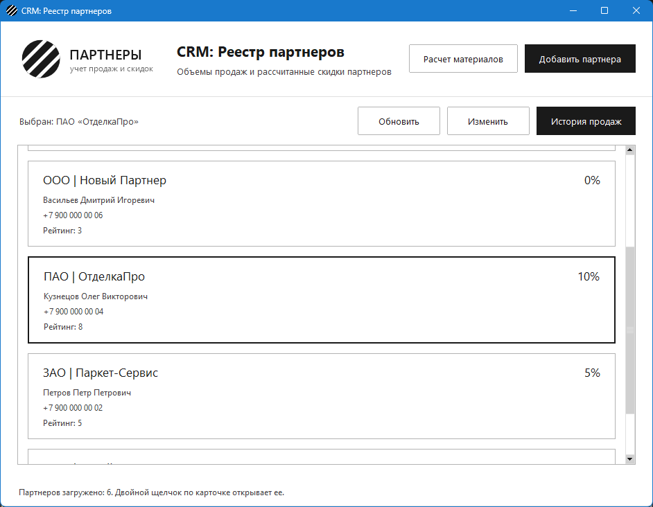
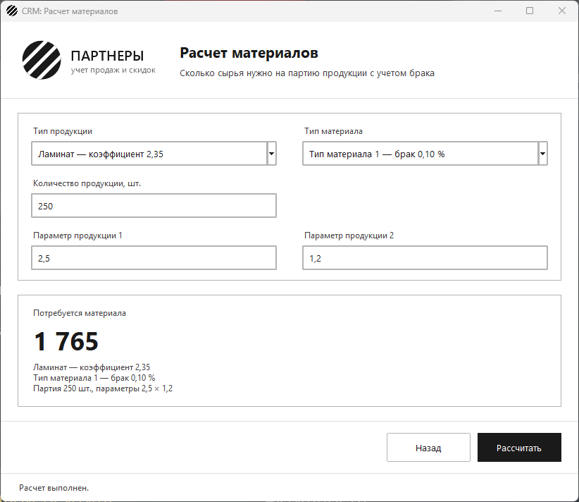
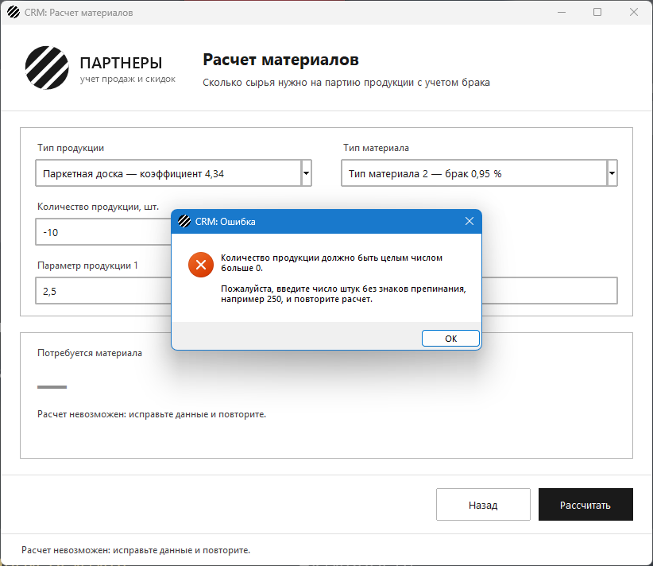

# Интеграция метода расчета и комплексное тестирование

Задание: внедрить метод расчета материалов в интерфейс, убедиться, что
некорректный ввод не роняет приложение, а возвращенный `-1` превращается
в понятное сообщение, и проверить код на правила оформления из ТЗ.

## Окно расчета материалов

На главной форме появилась кнопка «Расчет материалов». Она открывает
окно `MaterialCalculatorWindow` (`material_calculator_window.py`) с
заголовком `CRM: Расчет материалов`, логотипом и иконкой — в том же
стиле, что и остальные окна. Переход идет через тот же навигатор:
реестр прячется, «Назад», крестик и Esc возвращают к нему.



- **Тип продукции и тип материала** — выпадающие списки из справочников
  базы, рядом с названием видно коэффициент типа и процент брака.
  Менеджер выбирает по названию, а в метод уходит `id` записи.
- **Количество и два параметра продукции** — поля с подсказками;
  дробные числа можно писать и с запятой, и с точкой.
- **«Рассчитать»** (или Enter) вызывает
  `MaterialCalculator(DatabaseCatalog(connection)).calculate_material(...)`
  и показывает итог крупно, а под ним — по каким данным он получен.



## Отладка: что происходит с некорректными данными

Окно ничего не проверяет само и не повторяет логику метода: оно
переводит текст полей в числа (что не переводится — уходит в метод как
есть) и доверяет результату. Если метод вернул `-1`:

1. итог прежнего расчета стирается, чтобы старое число не выглядело
   новым;
2. окно спрашивает у калькулятора причину (`find_problem` — те же
   проверки, что внутри метода) и показывает окно ошибки с текстом и
   подсказкой, что исправить;
3. окно остается открытым, введенные данные — на месте.



| Ввод | Что увидит менеджер |
| --- | --- |
| количество `-10`, `0`, `2,5` или `сто` | «Количество продукции должно быть целым числом больше 0…» |
| параметр `-2,5`, `0` или пустое поле | «Параметры продукции должны быть положительными числами…» |
| тип продукции удален из справочника, пока окно было открыто | «Такого типа продукции нет в справочнике…» |
| то же с типом материала | «Такого типа материала нет в справочнике…» |
| база недоступна при открытии или расчете | окно ошибки с причиной и просьбой проверить PostgreSQL |

Справочники для списков читаются при открытии окна, а сам расчет каждый
раз заново обращается к базе. Поэтому тип, удаленный после открытия
окна, не посчитается по устаревшему коэффициенту — метод вернет `-1`.

## Проверка кода на правила ТЗ

- **Не более одной команды на строку** и **snake_case** проверяются
  автоматически тестом `test_code_style.py` по всем модулям папки: он
  разбирает код через `ast` и ищет строки, где начинается больше одной
  команды (`a = 1; b = 2`, `if x: return y`), точки с запятой, функции,
  аргументы и переменные не в `snake_case`, классы не в `CamelCase`.
  Исключения — только `setUp` и `tearDown`, их имена задает `unittest`.
  Сначала тест проверяет сам себя на заведомо плохих примерах.
- **Комментарии — только в неочевидных местах алгоритма:** почему расчет
  идет в `Decimal`, а не во `float`; почему нецелый `id` не отправляется
  в базу; почему окно показывает причину вместо `-1`; как устроен
  выпадающий список справочника (видно название, в расчет уходит `id`).

## Файлы

| Файл | Назначение |
| --- | --- |
| `material_calculator_window.py` | окно расчета материалов |
| `material_calculator.py` | метод расчета, справочники, причины ошибок |
| `form_fields.py` | поля формы, новый `ChoiceBox` — список записей справочника |
| `main_window.py`, `navigation.py` | кнопка «Расчет материалов» и переход в окно |
| `test_material_window.py` | комплексные тесты окна расчета |
| `test_code_style.py` | проверка правил оформления кода |
| `app_test_base.py` | заглушки базы, справочников и диалогов для тестов |
| остальные файлы | приложение и тесты из предыдущих заданий |

## Запуск

```
pip install -r requirements.txt
psql -U postgres -d partners_db -f schema.sql
python app.py
```

## Демонстрационный тест

```
python -m unittest -v
```

113 тестов. Новые — 23 на окно расчета и 5 на оформление кода. Окно
проверяется целиком, от кнопки в реестре до результата: открытие и
заголовок, списки из справочников, верный итог для двух наборов данных;
отрицательное, нулевое, дробное и написанное словами количество;
отрицательный, нулевой и пустой параметр; удаленные из справочника типы
продукции и материала; стирание старого итога после ошибки; недоступная
база при открытии и при расчете; возврат в реестр. Во всех случаях с
ошибкой окно остается открытым и показывает ровно ту причину, которую
вернул калькулятор.
