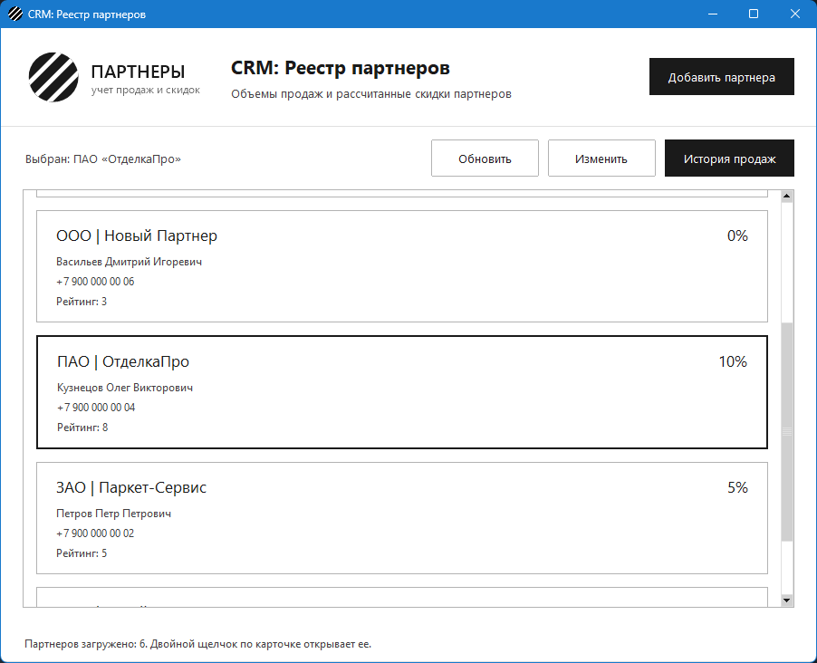
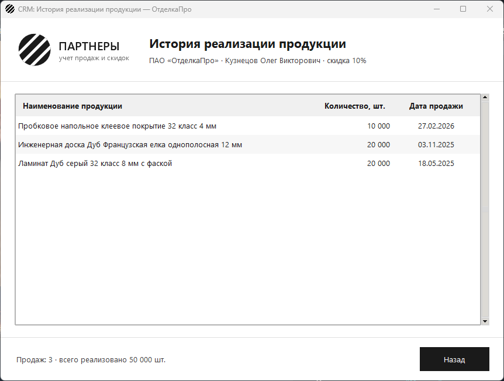

# Разработка интерфейса истории реализации продукции

Задание: менеджерам нужно видеть, какие объемы продукции и когда
реализовал конкретный партнер. Для этого — отдельное окно
`PartnerHistoryWindow` с историей отгрузок, переход в него с главной
формы и SQL-запрос с `JOIN`.

## Что сделано

1. **Новое окно `PartnerHistoryWindow`** (`partner_history_window.py`) —
   таблица `ttk.Treeview` с обязательными полями: наименование
   продукции, количество в штуках и дата продажи. Свежие продажи —
   сверху, строки чередуются по цвету, под таблицей итог: сколько было
   продаж и сколько всего реализовано.
2. **Руководство по стилю.** Те же цвета и шрифт Segoe UI, что и в
   остальных окнах, логотип компании в шапке, иконка приложения, а
   заголовок окна собирается из назначения и названия партнера:
   `CRM: История реализации продукции — ОтделкаПро`.
3. **Переход с главной формы.** Щелчок по карточке теперь выбирает
   партнера (карточка выделяется темной рамкой, над списком написано,
   кто выбран), а кнопки «История продаж» и «Изменить» включаются только
   при выбранном партнере. Двойной щелчок, как и раньше, открывает
   карточку на редактирование. «История продаж» передает в новое окно
   только `partner_id` — название партнера и продажи окно читает из
   базы само, поэтому данные всегда актуальные.
4. **SQL-запрос с `JOIN`** (`get_sales_history` в `partner_service.py`):
   название продукции хранится в справочнике `products`, а в
   `sales_history` — только ссылка на него.

   ```sql
   SELECT pr.name AS product_name,
          s.quantity,
          s.sale_date
   FROM sales_history AS s
   JOIN products AS pr ON pr.id = s.product_id
   WHERE s.partner_id = %s
   ORDER BY s.sale_date DESC, pr.name
   ```

   `partner_id` уходит в запрос параметром, а не вклеивается в текст.
   Дата выводится в привычном виде — `15.03.2025`, количество — с
   пробелами между разрядами: `150 000`.

Навигатор (`navigation.py`) теперь управляет любым дочерним окном —
карточкой партнера или историей продаж: на экране всегда одно окно,
реестр при переходе прячется и возвращается с тем же списком и тем же
выбранным партнером. «Назад», крестик окна и Esc возвращают в реестр.

Если у партнера нет продаж, таблица пустая, а внизу написано «Продаж у
партнера пока нет». Если база недоступна, окно все равно открывается и
показывает окно ошибки с причиной — приложение не падает.





## Изменения в базе данных

Чтобы история строилась через `JOIN`, в `schema.sql` появились
справочники:

- `product_types` — типы продукции (ламинат, массивная и паркетная
  доска, пробковое покрытие) с коэффициентом типа;
- `products` — продукция, у каждой свой тип;
- `sales_history` ссылается на продукцию через `product_id` вместо
  текстового названия.

Скрипт начинается с `DROP TABLE IF EXISTS`, поэтому его можно запускать
поверх старой базы: таблицы и тестовые данные создаются заново.

## Файлы

| Файл | Назначение |
| --- | --- |
| `partner_history_window.py` | `PartnerHistoryWindow` — история реализации продукции |
| `partner_service.py` | запросы: список партнеров, партнер по `id`, история продаж, запись |
| `main_window.py` | реестр: выбор партнера и кнопки «История продаж», «Изменить» |
| `partner_cards.py` | карточки списка, выделение выбранной |
| `navigation.py` | переходы между реестром и дочерними окнами |
| `ui_style.py` | цвета, шрифты, стили кнопок, полей и таблицы |
| `partner_edit_window.py`, `form_fields.py`, `validation.py`, `dialogs.py` | карточка партнера, проверка данных, диалоговые окна |
| `app.py`, `app_resources.py`, `db.py`, `partner_discount.py`, `main.py` | запуск, ресурсы, база, скидка, консольная проверка |
| `schema.sql` | таблицы и тестовые данные |
| `test_partner_history.py` | тесты запроса, форматирования и окна истории |
| `app_test_base.py` | заглушка базы и диалогов для оконных тестов |
| остальные `test_*.py` | тесты прошлых заданий |

## Запуск

```
pip install -r requirements.txt
psql -U postgres -c "CREATE DATABASE partners_db"
psql -U postgres -d partners_db -f schema.sql
python app.py
```

## Демонстрационный тест

```
python -m unittest -v
```

85 тестов, из них 17 на историю продаж: запрос соединяет продажи с
продукцией через `JOIN` и передает `partner_id` параметром, строки
превращаются в словари; количество и дата форматируются для человека;
кнопка «История продаж» выключена, пока партнер не выбран; окно
открывается с `id` выбранного партнера и его названием в заголовке, в
таблице три обязательных столбца и правильные строки, итог считается
верно; у партнера без продаж — сообщение вместо строк; «Назад»
возвращает в реестр с тем же выбранным партнером, а выбор переживает
перечитывание списка; несуществующий партнер и недоступная база не
роняют окно.
